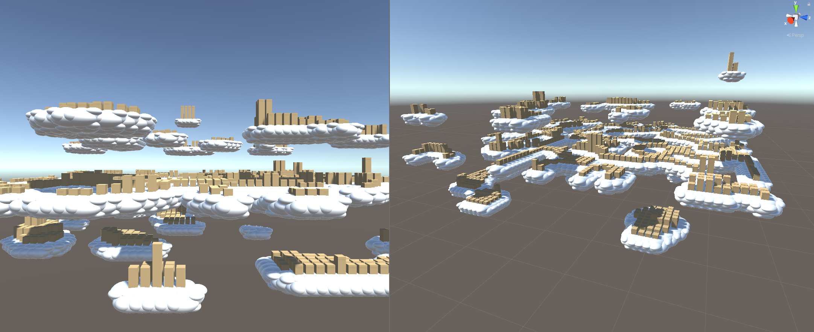
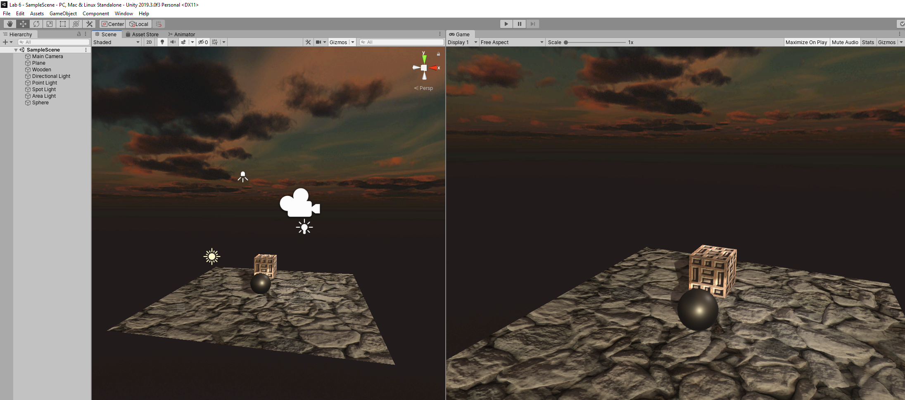

# CMPM163Labs

lab 8:
Inspiration: 
My city: 

The city in Bioshock Infinite ispired me to make a city floating in the clouds, using another layer of noise to seperate out the heights.

lab 7:
https://drive.google.com/file/d/1409rpF1EuCz8vkQW13lrYZ6uRicG9rsj/view?usp=sharing

I made the mountain by combining the vertex shader from the tutorial with a radial gradient so its higher in the center. I also adjusted it so the displacement was in both the x and z directions unlike in the tutorial. For the waves I adjusted it so there were waves in the z direction as well to make it more interesting. I added a few sparks coming from the mountain and a skybox from the asset store as extra.

My partner also did Part 1. They said  the most challenging part was changing the code for the circle to make it work on a plane for the mountain and the most interesting part was the mesh manipulation of the mountain.

Neither of us helped each other on the lab.

lab 6:

Point light is like a lightbulb and lights based off its position in the scene, directional light lights all objects in the scene from the direction it specifies no matter where it is in the scene, spotlights are like flash lights and illuminate in a cone shape where they are pointing from where they are positioned in the scene, area lights shine in all directions to one side of a rectangular plane but only works with baked lighting.

Material:

I chose my lamp because it was a simple metal surface so I dragged the metalic slider to 1 because it is a metal and then set the smoothness to 0.552 to make the reflectiveness of the light match what I saw in real life, with it being a fairly accurate reflection but some haze to it. I adjusted the Albedo color to a dark gray so it wasn't so bright and more of a dark silvery color.

I took 2 textures from Lab 4 to make a wood textured box and textured a plane to look like rocks for the ground.
I found a nice late sunset skybox texture from the unity asset store that I used for the skybox.

lab 5:
https://drive.google.com/file/d/1KQztpIsQET1WH8Y5CKJT7LT5hyB5VVPs/view?usp=sharing
Part 1

I made 4 particle systems for the kart and made them flat box emmitters coming from the wheels in world space so they left trails.
Then I attatched some swirlinjg particle systems to the checkpoints that do an extra bunching up flair behavior when you pass through the checkpoint. Then I made a new weird colored plasticy material that I applied to the driver.

lab 4:
https://drive.google.com/file/d/1CIIhmlRQ-SyYS7BtCvSWy9Gub_zFSeqe/view?usp=sharing

a. floor(u*8)
b. abs((floor(v*8))-7)
c. white

The top left cube has a texture and normal map using Three.js, The bottom left cube has just a texture using THREE.js, the middle cube has a texture and normal map using THREE.js, the bottom right cube is textured by the fragment shader in the lab, and the top right is the tiled texture from my fragment shader which I tiled by modding the coordinates by 0.5 to divide each side into 4 textures and then multiplied that by 2 so it would use the whole length of the texture instead of just one half along the x and y axis making it look like just a quarter of the texture in each quadrant.

lab3: 
https://drive.google.com/file/d/1q3VVaUCCvEHGWW4GTktvQ2eQW8UYZE-g/view?usp=sharing

For the first cube on the left I interpolated between CMYK with my own shaders, second from the left I used the Three.js physical material and made it slightly transparent, the second from the right was made with the Three.js phong material with a green specular highlight and the far right is a simpler color interpolation between blue and pink from the tutorial shader.

lab2: 
https://drive.google.com/file/d/1G_3p9cU6bLke4D10W2M85wBydvFDxph5/view?usp=sharing

